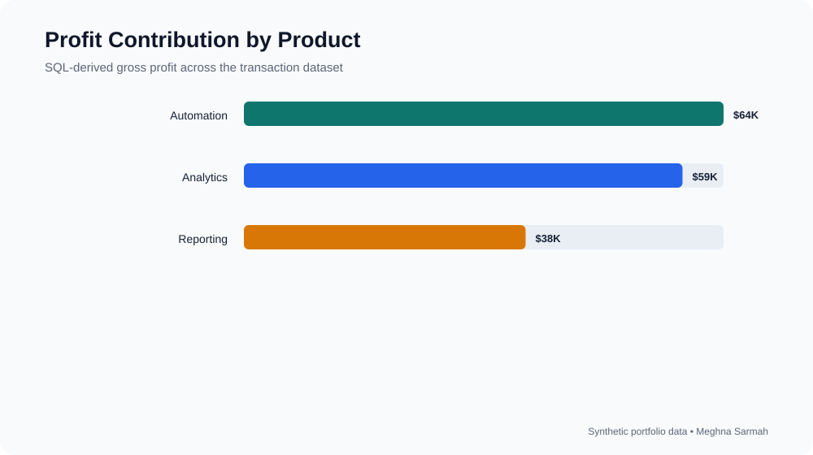

# SQL Profitability Analysis

SQL case study analyzing revenue, cost, gross profit, and customer concentration across products and regions.

## Profitability visualization



## Questions answered

- Which products generate the highest gross profit?
- Which regions are below the target gross-margin percentage?
- Which customers contribute the most revenue?
- Where are unfavorable month-over-month trends developing?

## Run

```bash
sqlite3 finance.db < schema.sql
sqlite3 finance.db < analysis.sql
```

The project demonstrates joins, aggregations, window functions, CTEs, ranking, and finance-focused KPI calculations using synthetic transactions.

## Business context

Revenue alone does not show which products, customers, or regions create economic value. This project uses SQL to build a repeatable profitability view from transaction-level data and separates high-volume activity from high-margin performance.

## Analysis workflow

1. Create a structured sales table with transaction, customer, region, product, revenue, and cost fields.
2. Calculate gross profit and gross-margin percentage.
3. Aggregate results by product, customer, region, and month.
4. Rank customers by revenue contribution.
5. Use window functions to compare monthly performance and identify concentration risk.

## Findings

- **Automation** generates the highest gross profit at **$64.2K**.
- **Analytics** has the strongest gross-margin percentage at approximately **51.5%**.
- **Reporting** produces **$37.7K** of gross profit with a lower margin of approximately **40.1%**, suggesting a pricing or delivery-cost review.

## Why SQL matters for Finance

The queries can be rerun as new transactions are added, avoiding manual spreadsheet grouping and providing a consistent audit trail from summary results back to source records. The same logic could feed a Power BI model or recurring management report.

## Repository structure

- **schema.sql** — table definition and synthetic transactions
- **analysis.sql** — profitability, ranking, trend, and concentration queries
- **project-overview.svg** — visual summary of product profit contribution

## Skills demonstrated

SQL, CTEs, aggregations, window functions, profitability analysis, customer concentration, margin analysis, and financial data validation.
